# SessionPrompt 流程图

本文档描述 `packages/opencode/src/session/prompt.ts` 的详细流程，与代码注释对应。

---

## 1. 入口总览

三个对外入口：`prompt`（常规发消息）、`command`（命名命令）、`shell`（用户执行 shell）。command 内部会调用 prompt；shell 占位 worker 后写入 synthetic 消息，不直接进 loop，退出时可选 resume loop。

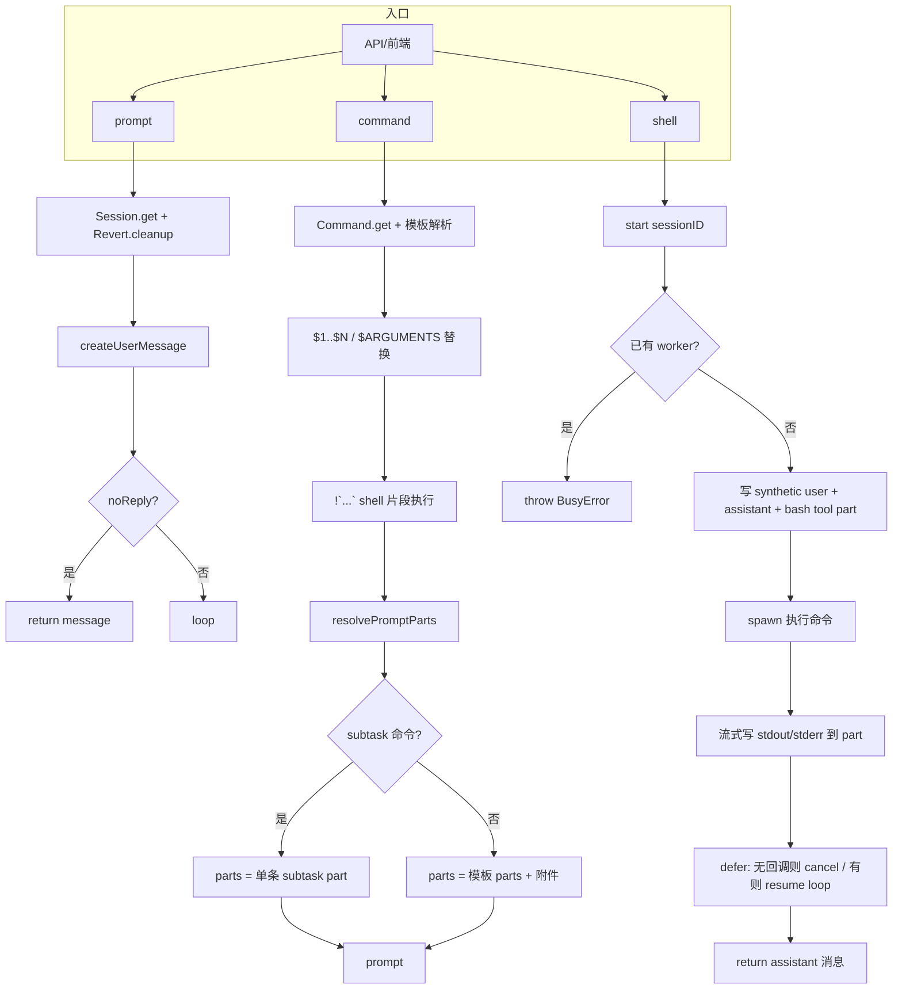

---

## 2. prompt → createUserMessage → loop

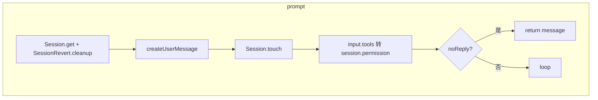

---

## 3. createUserMessage：parts 展开

将 `PromptInput.parts`（text / file / agent / subtask）展开为可持久化的 `MessageV2.Part[]`，并写入 Session。

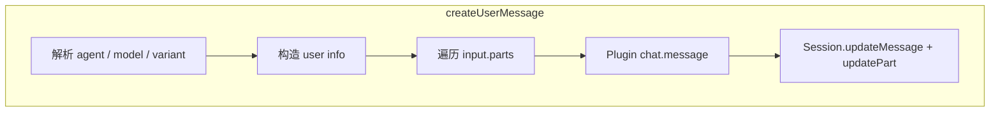

```mermaid
flowchart TB
  subgraph "part 类型分支"
    T[part.type]
    T --> text[text: 原样 + messageID/sessionID]
    T --> file[file]
    T --> agent[agent]
    T --> subtask[subtask: 原样]
  end

  subgraph "file 子分支"
    file --> F1{part.source?.type === "resource"?}
    F1 -->|是 MCP 资源| F2[MCP.readResource]
    F2 --> F3[插入 text part + 内容 / 错误]
    F1 -->|否| F4{url.protocol}
    F4 -->|data:| F5[解码 base64 + 模拟 Read + 原 part]
    F4 -->|file:| F6[filepath = fileURLToPath]
    F6 --> F7{stats.isDirectory?}
    F7 -->|是| F8[ListTool + 原 part]
    F7 -->|否| F9{mime}
    F9 -->|text/plain| F10[ReadTool + range/LSP + 原 part 或 attachments]
    F9 -->|其他| F11[base64 data URL file part]
  end

  subgraph "agent 子分支"
    agent --> A1[agent part + synthetic 文本: 用 task 调用 subagent]
  end
```

---

## 4. loop：worker 与并发

同一 session 同时只有一个活跃 worker；新调用者挂到 callbacks 等待同一结果。

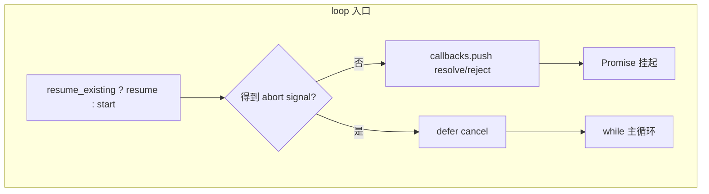

---

## 5. loop：主循环单轮（while true）

每轮：读流 → 解析 lastUser / lastAssistant / lastFinished / tasks → 按优先级执行一个分支 → 若未退出则 continue。

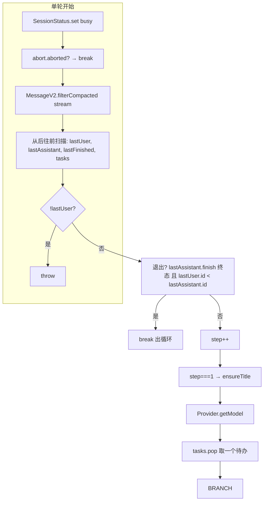

```mermaid
flowchart TB
  subgraph BRANCH[四选一分支]
    B1{task?.type === "subtask"?}
    B2{task?.type === "compaction"?}
    B3{lastFinished 且 token 溢出?}
    B4[常规 assistant 步]
  end

  B1 -->|是| SUB[执行 subtask 分支]
  B1 -->|否| B2
  B2 -->|是| COM[执行 compaction 分支]
  B2 -->|否| B3
  B3 -->|是| AUTO[自动 compaction]
  B3 -->|否| B4

  SUB --> CONT[continue]
  COM --> CONT
  AUTO --> CONT
  B4 --> RES[根据 result stop/compact/continue]
  RES --> CONT
  CONT --> NEXT[下一轮]
```

---

## 5.1 loop 详细示例（带具体消息序列）

下面用「消息流 + 每轮扫描结果 + 走哪个分支」的方式把 loop 跑通几遍，便于对照代码理解。

**约定**：消息用 `U1`（user）、`A1`（assistant）表示，`A1(finish)` 表示该条 assistant 已有 `info.finish`（如 `"stop"`）；part 简写为 `text`、`tool`、`subtask`、`compaction`。

---

### 示例 1：最简单的一问一答（无工具、无 subtask）

**初始流**（prompt 刚写完 user，进入 loop）：

```
[ U1: [text] ]   ← createUserMessage 已写入，lastUser 就是这条
```

- **第 1 轮**
  - 读流：`msgs = [U1]`
  - 从后往前扫：`lastUser=U1`，`lastAssistant=undefined`，`lastFinished=undefined`，`tasks=[]`
  - 退出？否（没有 lastAssistant）
  - `step=1`，可选 ensureTitle，取 model，`task=tasks.pop()=undefined`
  - 走**分支 4（常规 assistant）**：创建空 assistant 消息 A1，`processor.process` 调模型，模型直接回复并 finish="stop"
  - `result="stop"` → **break**
- **循环结束**：`SessionCompaction.prune`，从流里取最新 assistant（A1），resolve 回调，return A1

**最终流**：`[ U1, A1(finish=stop) ]`，返回 A1。

---

### 示例 2：用户发了一条「带 subtask part」的消息（例如执行了 /explore 命令）

**初始流**：

```
[ U1: [subtask(agent=explore, prompt="...")] ]
```

- **第 1 轮**
  - 读流：`msgs = [U1]`
  - 扫描：`lastUser=U1`，`lastAssistant=undefined`，`lastFinished=undefined`；从后往前在 U1 里看到 `subtask` part，且此时尚未遇到任何 `lastFinished`，所以 `tasks=[subtask]`
  - 退出？否
  - `task = tasks.pop()` → 取出这条 **subtask**
  - 走**分支 1（subtask）**：执行 TaskTool，在**本 session** 里写入一条「占位」assistant 消息 A1 + 一个 tool part（task 工具，running→completed），子 session 内部跑完后再把结果写回这个 tool part；若 `task.command` 存在还会插一条 synthetic user
  - **continue**，进入第 2 轮
- **第 2 轮**
  - 读流：`msgs = [ U1, A1(finish=tool-calls), (可选) U_synth ]`
  - 扫描：`lastUser=U1`（或 U_synth），`lastAssistant=A1`，`lastFinished=A1`（因为 A1 有 finish）；遇到 lastUser 且 lastFinished 后 break，tasks 只收集「在 lastFinished 之前」的 part，所以这轮 `tasks=[]`
  - 退出？检查：`lastAssistant.finish="tool-calls"` 属于非终态，**不退出**
  - `task=undefined`，不走 subtask/compaction；若 lastFinished 的 token 未溢出也不走自动 compaction
  - 走**分支 4（常规 assistant）**：创建 A2，把「U1 + A1 + tool 结果 + 可选 U_synth」送给模型，模型看到 task 工具的输出后生成总结或下一步，若 finish="stop" 则 `result="stop"` → **break**
- **循环结束**：取最新 assistant（A2），return A2

**最终流**：`[ U1, A1(tool part), (可选) U_synth, A2(finish=stop) ]`，返回 A2。

---

### 示例 3：模型先调用了工具，再继续回复（无 subtask）

**假设第 1 轮**已经跑完一次 assistant，模型决定调 Read 工具，于是当前流是：

```
[ U1, A1: [tool(Read), ...],  U2(synthetic): [text "工具结果..."] ]
```

这里 U2 是系统根据工具结果插入的「模拟 user」（或真实 user 消息）。下一轮：

- **第 2 轮**
  - 读流：`msgs = [U1, A1, U2]`（A1 可能 finish=tool-calls）
  - 扫描：`lastUser=U2`，`lastAssistant=A1`，`lastFinished=A1`（若 A1 有 finish）
  - 退出？若 A1.finish 为 "tool-calls" 则非终态，**不退出**
  - `tasks=[]`，不走 subtask/compaction
  - 走**分支 4**：创建 A2，把 U1、A1、U2 和工具结果一起给模型，模型基于工具结果写最终回复，finish="stop" → **break**
- **循环结束**：return A2

**要点**：工具调用后，消息流里会有「assistant + tool part」和后续的 user（真实或 synthetic），loop 下一轮读流时自然看到这些，再走一次常规 assistant 步即可。

---

### 示例 4：多轮对话 + 退出条件

**当前流**：

```
[ U1, A1(finish=stop), U2, A2(finish=stop) ]
```

- **第 3 轮**（假设 U2 刚写入，loop 正在跑）
  - 读流：`msgs = [U1, A1, U2, A2]`
  - 从后往前：先看到 A2 → `lastAssistant=A2`，`lastFinished=A2`；再看到 U2 → `lastUser=U2`；满足 `lastUser && lastFinished`，扫描 break；`tasks=[]`
  - **退出判断**：`lastAssistant.finish` 为 "stop"（终态），且 `lastUser.id < lastAssistant.id`（U2 < A2），**满足退出条件** → **break**
  - 不执行任何分支，直接退出 while
- **循环结束**：取最新 assistant（A2），return A2

**要点**：只有当「当前最后一条 assistant 已经 finish 且是终态」并且「这条 assistant 比最后一条 user 更新」时，才认为「已经回复完最新 user」，loop 才退出。

---

### 示例 5：有 compaction part 时（历史过长被摘要）

**当前流**（compaction 已被创建为一条消息里的 part，等待处理）：

```
[ ..., U_last, A_prev(finish=stop), MsgWithPart: [compaction(auto)] ]
```

- **某一轮**
  - 扫描：`lastUser=U_last`，`lastAssistant` 可能是 MsgWithPart 或更早的 assistant，`lastFinished=A_prev`；在「lastFinished 之后」的消息里收集到 `compaction` part → `tasks=[compaction]`
  - `task = tasks.pop()` → **compaction**
  - 走**分支 2**：`SessionCompaction.process(...)`，若返回 `"stop"` 则 **break**；否则 **continue**，下一轮流里可能已是摘要后的新消息布局，再按同样逻辑扫 lastUser/lastAssistant/lastFinished/tasks

**要点**：compaction 以「消息中的 compaction part」形式排队，loop 像处理 subtask 一样从 `tasks` 里 pop 出来执行，执行完再继续下一轮。

---

### 小结：谁决定「下一轮干什么」？

| 本轮得到 | 下一轮/本轮动作 |
|----------|-----------------|
| `lastUser` 且 `lastAssistant.finish` 为终态 且 `lastUser.id < lastAssistant.id` | **退出** loop，返回该 assistant |
| `tasks` 里有 `subtask`，pop 出 subtask | **分支 1**：执行 TaskTool，写 assistant+tool part，continue |
| `tasks` 里有 `compaction`，pop 出 compaction | **分支 2**：`SessionCompaction.process`，stop 或 continue |
| 无 task，但 `lastFinished` 且 token 溢出 | **分支 3**：自动创建 compaction，continue |
| 以上都不满足 | **分支 4**：常规 assistant 一步（调模型），根据 result 为 stop/compact/continue |

扫描顺序（从流尾往流头）保证：**lastUser = 最后一条 user**，**lastFinished = 最后一条带 finish 的 assistant**，**tasks = 在 lastFinished「之后」出现的所有 compaction/subtask part**（即尚未被「一次完整 assistant 步」消化掉的待办）。

---

## 5.2 模型交互的消息流程与示例

本节说明：**我们存的消息长什么样**、**发给大模型 API 时又变成什么样**、以及**一次「模型交互」的完整往返**。不熟悉多轮对话 / 工具调用 API 的读者可重点看本节。

### 5.2.1 大模型 API 通常怎么表示对话？

常见约定（OpenAI / Anthropic / 本系统用的 AI SDK 等）：

- **角色**：`system`（系统设定）、`user`（用户）、`assistant`（助手）。
- **多轮**：按时间顺序排列消息，例如：`[ system, user1, assistant1, user2, assistant2 ]`。模型根据**整段历史**生成下一条 assistant。
- **工具调用**：assistant 消息里可以带 `tool_calls`（我要调哪些工具、参数是什么）；下一轮必须跟**工具结果**（通常用 `user` 或专门的 `tool` 角色），模型再根据结果继续生成文字或再次调工具。
- **流式**：模型一边生成一边返回 token（文字片段 / reasoning / tool_calls），我们边收边写存储、边更新 UI。

所以「模型交互」的一轮 =：我们发 **system + 历史 messages + 本轮的 prompt（若有）**，模型返回 **一条 assistant 的流**；若这条 assistant 里包含 tool_calls，我们执行工具、把结果写入存储，**下一轮**（或同轮内继续）把「历史 + 工具结果」再发给模型，直到模型不再调工具、给出「终态」回复为止。

---

### 5.2.2 本系统里的两层：存储形态 vs 发给模型的形态

**存储形态（MessageV2）**

- 每条消息有 `info`（id、role、sessionID、model、agent、finish 等）和 `parts`（内容块数组）。
- **user**：parts 可以是 `text`、`file`（附件）、`subtask`、`compaction` 等。
- **assistant**：parts 可以是 `text`、`tool`（某次工具调用的入参/结果/状态）、`reasoning`（思考过程，见下）等。
- 流式写入：每次模型吐出一段，我们就往当前这条 assistant 消息里追加 part（或更新已有 tool part 的状态）。

**发给模型时的形态（ModelMessage[]）**

- 由 `MessageV2.toModelMessages(sessionMessages, model)` 产生：把「当前会话里要参与本次调用的消息」转成 API 能接受的格式。
- 内部先转成 **UIMessage[]**（每条带 `role` + `parts`）：
  - user → `role: "user"`，parts：text 原样、file 转成 url/mediaType、subtask/compaction 转成固定提示文案。
  - assistant → `role: "assistant"`，parts：text、tool 转成 `tool-{name}`（含 toolCallId、input、output/error）。
- 再用 AI SDK 的 `convertToModelMessages` 把 UIMessage[] 转成真正的 **ModelMessage[]**（不同 provider 可能略有差异，但都是 role + content 或 parts 结构）。
- **system**：不来自单条消息，而是拼出来的——`SystemPrompt.environment(model)` + `InstructionPrompt.system()` + agent 的 prompt 等，在 `processor.process` 里作为 `system` 数组传给 `LLM.stream`。

因此：**同一次「调用模型」** 时，输入 = `system`（字符串数组）+ `messages`（ModelMessage[]，来自 toModelMessages）+ `tools`（工具定义）。输出 = 流式结果，我们据此更新当前 assistant 的 parts，并在需要时执行工具、下一轮再发。

---

### 5.2.3 一次「调用模型」的输入从哪里来？

在 **分支 4（常规 assistant 步）** 里：

1. **system**：`await SystemPrompt.environment(model)` + `await InstructionPrompt.system()`（以及 agent 自己的 prompt 等在 LLM.stream 里拼）。
2. **messages**：`MessageV2.toModelMessages(sessionMessages, model)`，其中 `sessionMessages` 是**当前会话里、经 filterCompacted 后的消息列表**（可能还做过 insertReminders、system-reminder 包装、插件变换）。即：**从会话里读出来的历史 + 刚写的 user，全部转成 API 格式**。
3. **tools**：`resolveTools(...)` 得到的工具表（内建 + MCP 等），模型可以在这轮里选择调用。

所以：**模型看到的「对话历史」= 我们存下来的 user/assistant 序列，转成 API 格式**；**本轮要生成的** = 当前这条新建的 assistant 消息，流式写入其 parts。

---

### 5.2.4 示例 A：用户说一句话，模型直接文字回复（无工具）

**存储里发生的事**

1. 用户发「介绍一下你自己」→ `createUserMessage` 写入一条 user 消息 U1，parts = `[{ type: "text", text: "介绍一下你自己" }]`。
2. loop 第 1 轮：读流得到 `msgs = [U1]`，走分支 4，创建空 assistant 消息 A1，调用 `processor.process`。

**发给模型的一次请求（概念上）**

- **system**：环境说明 + 指令 + agent 的 system 文案。
- **messages**：`toModelMessages([U1], model)` → 相当于 `[{ role: "user", content: "介绍一下你自己" }]`（或该 provider 的 parts 等价形式）。

**模型返回**

- 流式输出一段文字，例如「我是 OpenCode 的 AI 助手……」。我们边收边往 A1 里追加 `text` part，结束时把 A1 标上 `finish: "stop"`。
- loop 下一轮：扫描到 lastAssistant=A1、lastFinished=A1、lastUser=U1，且 lastUser.id < lastAssistant.id，**退出条件满足**，返回 A1。

**用户侧看到**：一条用户消息 + 一条助手回复。背后只有**一次**模型 API 调用。

---

### 5.2.5 示例 B：用户问「src/foo.ts 第 10 行是什么」，模型先调 Read 再回复

**存储里发生的事**

1. 用户发「src/foo.ts 第 10 行是什么」→ U1 写入，parts = `[{ type: "text", text: "..." }]`（若带文件引用还会展开成 file part 等）。
2. loop 第 1 轮：走分支 4，创建 A1，发 `messages = toModelMessages([U1])`。模型决定调用 Read 工具，流里除了文字外还有 `tool_calls`。
3. 我们边收边写 A1 的 parts：先可能有一段 `text`（如「正在查看…」），再有一个 `tool` part（Read，状态 running → 执行完后更新为 completed，output 为文件内容）。
4. 此时 A1 的 `finish` 可能是 `"tool-calls"`（表示本步以工具调用结束）。**不会**在这里退出 loop。
5. 工具结果写回存储后，通常还会插入一条 **synthetic user** 或在下一次 assistant 的上下文中包含工具结果（具体实现里由消息流结构决定）。loop 第 2 轮：读流得到 `msgs = [U1, A1, U2]`，其中 U2 可能是系统插入的「工具执行结果」或等效内容。
6. 第 2 轮再走分支 4：创建 A2，发 `messages = toModelMessages([U1, A1, U2])`。此时 **A1 里已经包含 tool part（completed）**，toModelMessages 会把 A1 转成带 `tool-Read` 的 assistant 消息（含 output），U2 或等效内容会作为「工具结果」出现在模型看到的历史里。
7. 模型根据「用户问题 + 自己调过的 Read + 工具返回的内容」生成最终文字回复，A2 只有 text part，finish="stop"。loop 下一轮满足退出条件，返回 A2。

**用户侧看到**：用户问 → 助手先「查了一下」→ 再给出「第 10 行是 xxx」。背后是**两次**模型 API 调用（第一次带工具、第二次带工具结果历史）。

---

### 5.2.6 示例 C：多轮对话（两问两答）

**存储里的消息顺序**

- U1：「帮我写一个 hello world」
- A1：写代码、调 Write 工具等，finish=stop
- U2：「再加一个注释」
- A2：只改注释，finish=stop

**某次「再加一个注释」之后的 loop 轮**

- 读流：`msgs = [U1, A1, U2]`（A2 还没生成）或已经包含 A2。
- 若本轮要生成 A2：`messages = toModelMessages([U1, A1, U2])`。模型看到的是：第一问、第一答（含之前的工具调用）、第二问。它只需在**最后一轮上下文**里回答「加注释」，不必重复前面所有细节。
- 生成完毕 A2 后，下一轮扫描到 lastUser=U2、lastFinished=A2，满足退出条件，返回 A2。

**要点**：**历史消息全部参与 toModelMessages**，所以模型始终能看到完整对话；我们只追加新消息、不删历史（除非做 compaction 摘要）。

---

### 5.2.7 小结：模型交互与 loop 的对应关系

| 环节           | 在代码/流程中的位置 |
|----------------|----------------------|
| 历史消息从哪来 | loop 里 `MessageV2.filterCompacted(MessageV2.stream(sessionID))` → `sessionMessages` |
| 转成 API 格式  | `MessageV2.toModelMessages(sessionMessages, model)` |
| system 从哪来 | `SystemPrompt.environment(model)` + `InstructionPrompt.system()`，LLM.stream 内再拼 agent 等 |
| 工具定义       | `resolveTools(...)`，和 messages 一起传给 `LLM.stream` |
| 一次调用       | `processor.process({ system, messages, tools, ... })` → `LLM.stream` → 流式写入当前 assistant 的 parts |
| 工具结果进历史 | 工具执行后写回 assistant 的 tool part（及可能的 synthetic user），下一轮 toModelMessages 会包含这些，模型就能看到工具结果 |
| 何时结束       | 模型返回 finish 为终态（如 "stop"），且 lastUser.id < lastAssistant.id 时，loop 退出并返回该 assistant |

若你更关心「某一条消息在 toModelMessages 里具体变成什么」，可看 `message-v2.ts` 的 `toModelMessages`（user/assistant 的 parts 如何映射到 UIMessage，再经 `convertToModelMessages` 成 ModelMessage）。

---

### 5.2.8 reasoning 是什么？

**reasoning** 是部分大模型提供的「**思考过程**」输出：在生成最终回答之前（或同时），模型会先输出一段「内心独白」式的推理内容（链式思考、规划步骤等），这段内容与面向用户的「正文」分开。

在本系统里：

- **存储**：assistant 消息的 parts 里可以有 `type: "reasoning"` 的 **ReasoningPart**，包含 `text`（思考内容）、`time`（start/end）、可选的 `metadata`（provider 元数据）。与普通 `text` part 区分开，便于 UI 选择展示或折叠。
- **流式**：模型在流式返回时可能发出 `reasoning-start` / `reasoning-delta` / `reasoning-end` 事件（由各 provider 的 AI SDK 适配层产生）。`SessionProcessor` 收到后创建或追加 ReasoningPart，并写入 Session（见 `processor.ts` 的 `reasoningMap` 与对应 case）。
- **计费**：部分模型对「思考」token 单独计费，`tokens.reasoning` 会记录并在计费时按输出 token 单价计（见 `session/index.ts`）。
- **发给模型的历史**：`toModelMessages` 会把 reasoning part 转成 `type: "reasoning"` 的 UIMessage part 发给 API；若同一轮换模型，部分 provider 的 transform 会过滤掉 reasoning，避免不兼容。

**典型用途**：支持「扩展思考」的模型（如 Claude extended thinking、OpenAI o1、部分 Gemini 等）会输出 reasoning；前端可选择显示「思考过程」或仅显示最终 `text` 回答。

---

## 6. 分支 1：subtask

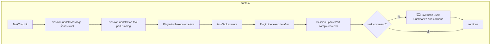

---

## 7. 分支 2：compaction（显式 part）

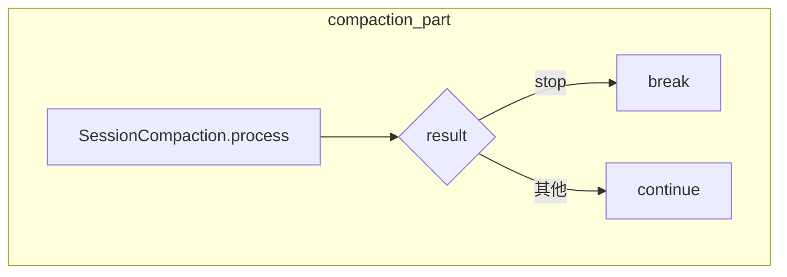

---

## 8. 分支 3：自动 compaction（token 溢出）

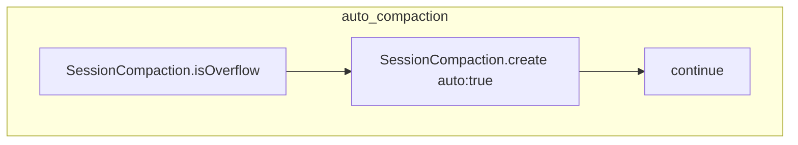

---

## 9. 分支 4：常规 assistant 步

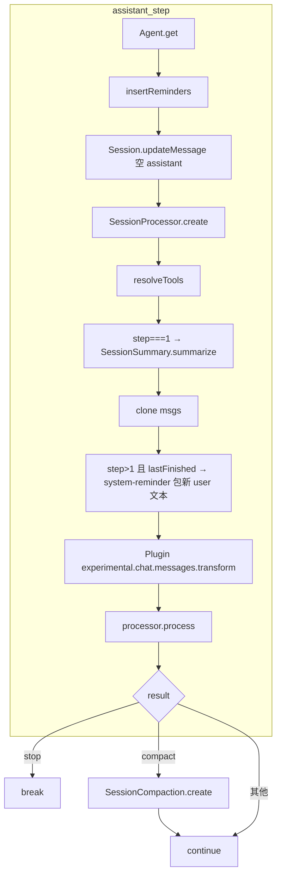

```mermaid
flowchart LR
  subgraph processor.process 输入
    S[system: environment + instruction]
    M[messages: toModelMessages + 可选 MAX_STEPS]
    T[tools: resolveTools]
    U[user, agent, abort, sessionID]
  end
  subgraph 输出
    R[result: stop | compact | 其他]
  end
  S --> P[流式调用模型]
  M --> P
  T --> P
  U --> P
  P --> R
```

---

## 10. 循环结束后

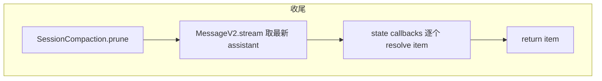

---

## 11. resolveTools

合并内建工具与 MCP 工具，统一包装 context（sessionID、messageID、callID、abort、metadata、ask）与插件 before/after。

```mermaid
flowchart TB
  subgraph resolveTools
    R1[context 工厂]
    R2[ToolRegistry.tools]
    R3[每工具: ProviderTransform.schema + tool() + execute 包装]
    R4[MCP.tools]
    R5[每 MCP: ask + 执行 + 结果转 text/attachments + Truncate]
    R6[return tools]
  end
  R1 --> R2 --> R3
  R2 --> R4 --> R5
  R3 --> R6
  R5 --> R6
```

---

## 12. insertReminders

根据 agent（plan/build）与实验开关，向最新 user 消息追加 synthetic 提示。

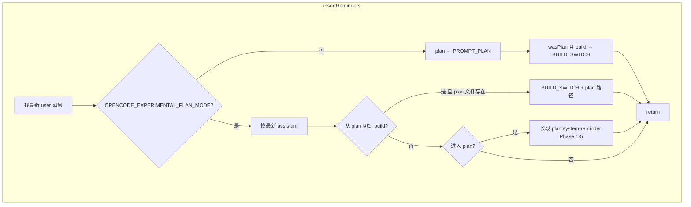

---

## 13. ensureTitle（首步时异步）

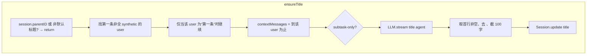

---

## 14. 数据流简图（状态与存储）

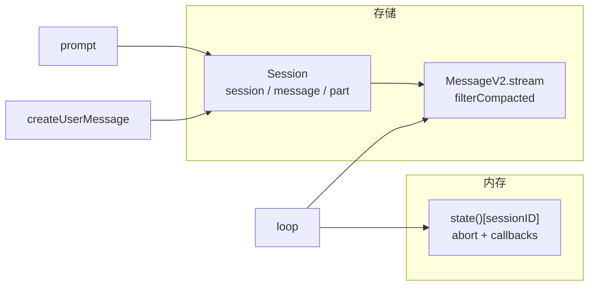

以上流程图与 `prompt.ts` 中注释和逻辑一一对应，可配合源码阅读。
